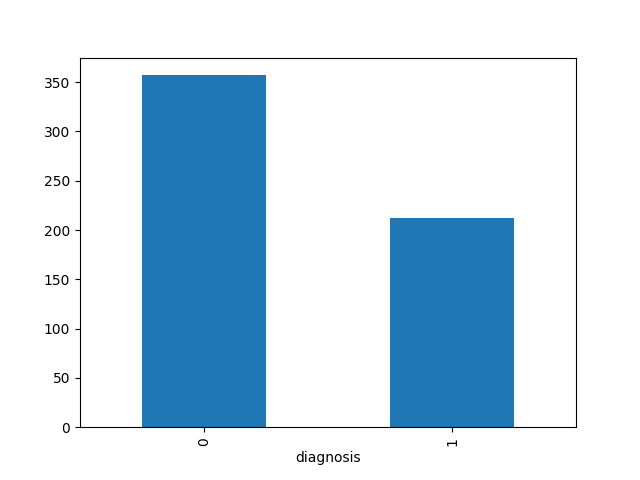
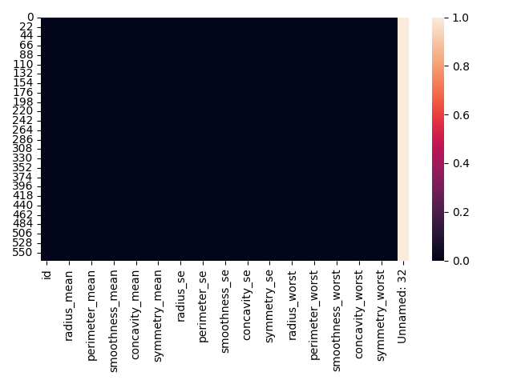

# Logistic Regression on Breast Cancer Dataset

This project demonstrates the application of **logistic regression** on the [Breast Cancer Wisconsin (Diagnostic) dataset](https://www.kaggle.com/datasets/uciml/breast-cancer-wisconsin-data) to classify tumors as **malignant** or **benign** based on cell nucleus features.


---

## 📖 Project Description
Breast cancer is one of the most common cancers worldwide, and early detection is crucial. This dataset contains measurements of cell nuclei from breast cancer biopsies. Using logistic regression, we can build a classification model that predicts whether a tumor is malignant (cancerous) or benign (non-cancerous).

The dataset includes **569 samples** with **30 numerical features** such as radius, texture, perimeter, area, smoothness, and more. Logistic regression is chosen because it is simple, interpretable, and effective for binary classification.

---

## 📂 Files in Repository

- **`breast-cancer.csv`** — Dataset file from Kaggle.
- **`main.py`** — Main script containing the workflow: preprocessing, model training, and evaluation.
- **`requirements.txt`** — Python dependencies required for the project.
- **`diagnosis_plot.png`** — Visualisation of diagnosis distribution.
- **`isnull_heat_map.png`** — Visualisation of missing values.

---

## ⚙️ Installation & Setup

Clone the repository and install dependencies:

```bash
git clone https://github.com/migzster-snow/logistic-regression-breast-cancer.git
cd logistic-regression-breast-cancer

# (Optional) Create virtual environment
python -m venv venv
source venv/bin/activate      # Mac/Linux
venv\Scripts\activate         # Windows

# Install required packages
pip install -r requirements.txt
```

---

## 🚀 Usage

Run the logistic regression pipeline:

```bash
python main.py
```

This will:
1. Load and preprocess the dataset.
2. Perform feature scaling with **StandardScaler**.
3. Split the data into training and testing sets.
4. Train a logistic regression classifier.
5. Evaluate model performance with accuracy and classification report.

---

## 📊 Results

- **Accuracy:** ~98.25%

Example classification report:
```
              precision    recall  f1-score   support
           0       0.99      0.98      0.99       108
           1       0.97      0.98      0.98        63
    accuracy                           0.98       171
   macro avg       0.98      0.98      0.98       171
weighted avg       0.98      0.98      0.98       171
```

### Visualisations
- **Diagnosis Distribution**
  

- **Missing Values Heatmap**
  

---

## 🛠️ Technologies Used
- **Python**
- **Pandas** for data handling
- **Seaborn** & **Matplotlib** for visualisation
- **scikit-learn** for preprocessing, model training, and evaluation

---

## 🙌 Acknowledgements
- Dataset: [Breast Cancer Wisconsin (Diagnostic)](https://www.kaggle.com/datasets/uciml/breast-cancer-wisconsin-data)
- Inspired by machine learning in **healthcare applications**
